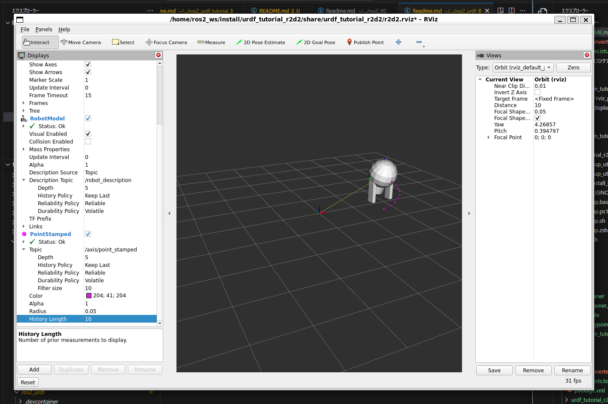

# Rviz2 development

https://docs.ros.org/en/humble/Tutorials/Intermediate/RViz/RViz-Main.html

## Packages

- rviz_plugin_tutorial: https://docs.ros.org/en/humble/Tutorials/Intermediate/RViz/RViz-Custom-Display/RViz-Custom-Display.html
- urdf_turorial_r2d2: https://docs.ros.org/en/humble/Tutorials/Intermediate/URDF/Using-URDF-with-Robot-State-Publisher.html
- tf2_tool: echo and publish stampled pose from tf2 frames

### Usage

Launch simulate a walking robot

``` bash
ros2 launch urdf_tutorial_r2d2 demo.launch.py
```

Open a new terminal, the run rviz

``` bash
rviz2 -d `ros2 pkg prefix --share urdf_tutorial_r2d2`/r2d2.rviz
```

Open a new terminal, the run tf2_converter

``` bash
ros2 run tf2_tool tf2_converter odom axis
```

arg 1 <source_frameid> : from
arg 2 <target_frameid> : to

It will be displayed the target frame trajectory as following.


